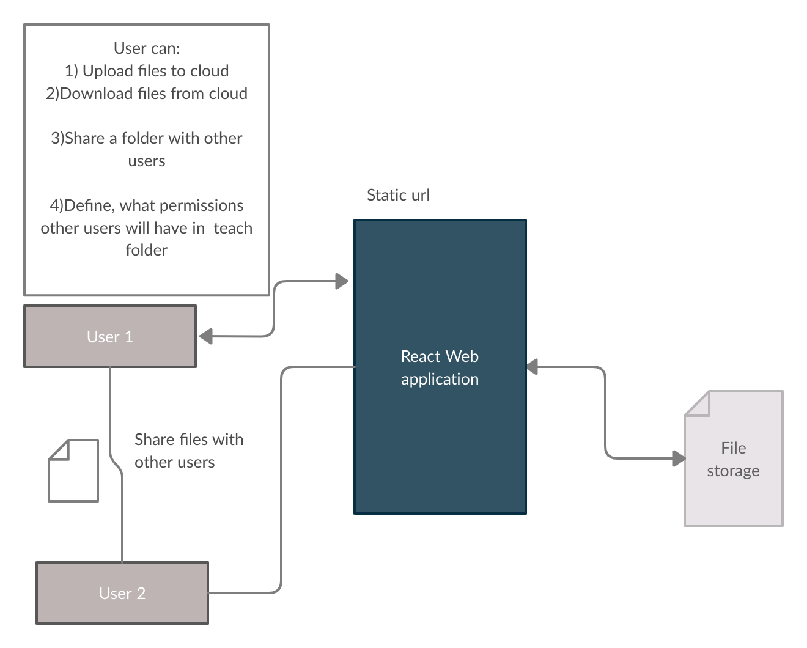
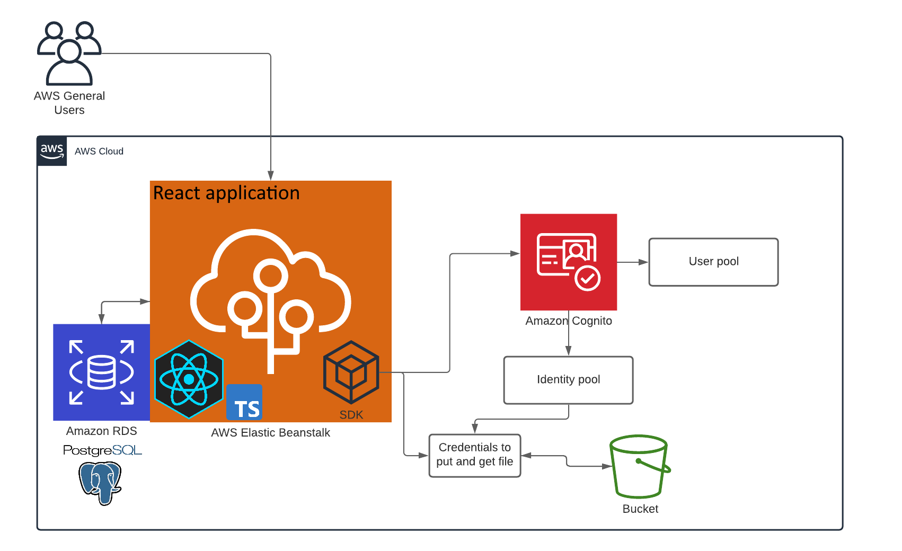
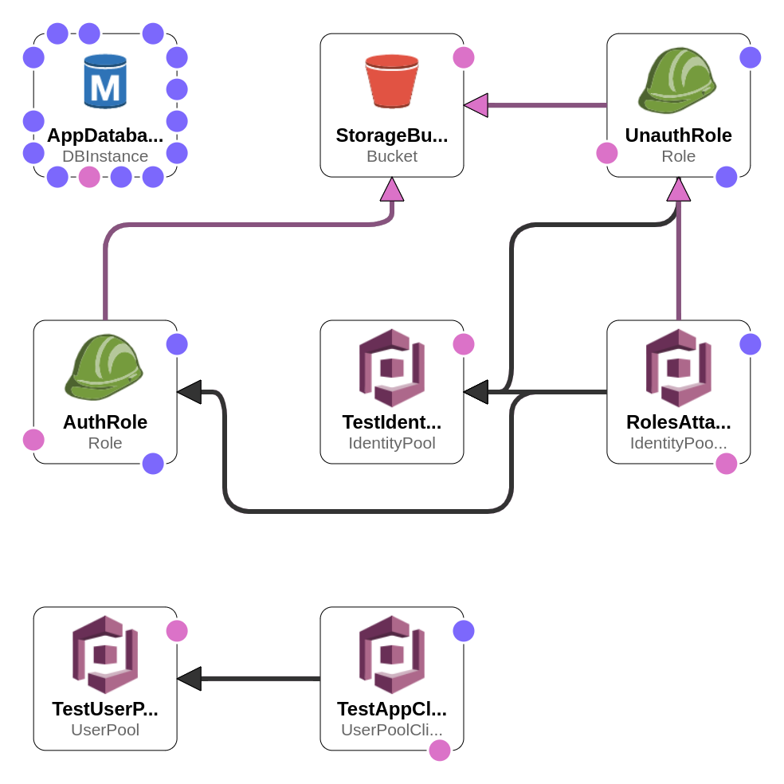
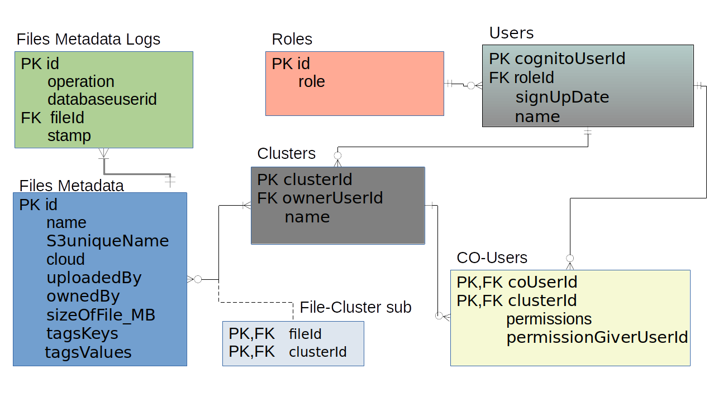

# UniFileShare application
Web application for storing and sharing your files in the cloud.
## Install:
1. Clone this repository.
2. Install all dependencies.
```bash
$ npm install
``` 
3. Install eb (Elastic Beanstalk) CLI: https://github.com/aws/aws-elastic-beanstalk-cli-setup.
4. Configure your AWS CLI


## Deploy (To a new Elastic Beanstalk Environment):
Run these scripts from `package.json`:
* run `cloudformation-deploy` - initialize all cloud infrastructure.
* `wait!` until the CloudFormation stack is ready.
* run `deploy`. This will generate a file with all configuration (ids, database endpoint, passwords, etc), then build project, create an artifact and upload it to the Elastic Beanstalk environment. After, the script will publish rest of the database infrastructure. 

Other scripts:
* `start-dev` - run development server with `nodemon`.
* `start` - run production server.
* `test` - run all tests in `tests` directories.
* `watch` - run webpack with watch mode.
* `lint` - run eslint.

## Project description

_Each user will have access to the following list of actions after registration:_
* **Create a new cluster** (it is like a folder for this application).
* **Upload a file** to the chosen cloud and:
  * With possibility to add **user tags**, which can be used in future for quick search. (For example, Amazon Athena with tagged files in the S3 bucket).
  * **All file metadata will be stored in the RDS database** (in this case it is PostreSQL), therefore it can be queried for any needs, for instance if you want to know information relating to the file (size, name), or when and who uploaded it, also, you can get the user tags for any file without requesting it from S3 bucket.
  * The file itself will be uploaded to S3 bucket and renamed with a unique name and unique path.
* Any **cluster can be shared with another user**, and the owner of cluster can decide, which permissions other user will have. (You can choose whether this user can upload, download, delete or give others any permissions to use your cluster).


**_Additional information_**:
1. You can adjust available storage size for each user in application configuration file.
2. Microsoft Azure cloud can be added in the future as a destination option for the file uploading.
3. There is a script for automated application deployment to AWS Elastic Beanstalk. All cloud infrastructure will be added as a new Stack in AWS CloudFormation with a corresponding CloudFormation template, we are using Infrastructure as code method for the future maintenance.


**Following tools and languages were used in this project:**
1. React, React bootstrap, React Redux for front-end.
2. NodeJs for back-end.
3. AWS SDK.
4. To authorize users, we are using JSON Web Tokens, signed with AWS Cognito user pool.
5. Programming language: Typescript

**High-level view**


**Project architecture**:


**AWS platform project infrastructure<br>(CloudFormation template)**


**Database schema**
